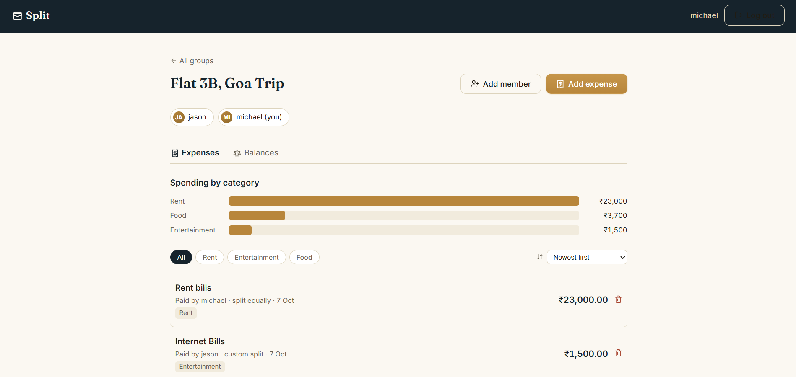
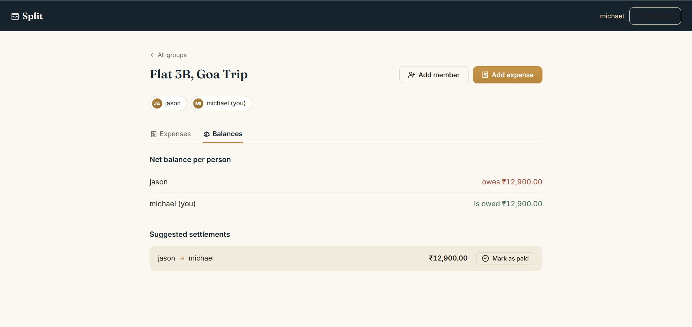

# 💸 Split — Shared Expense Tracker

A full-stack web app for splitting group expenses fairly — log what everyone
spends, split it equally or by custom amount, and let the app work out the
smallest set of payments needed to settle everyone up.


---

## 📸 Screenshots

<!--
  Add your own screenshots here before pushing to GitHub — see the
  "Adding screenshots" section near the bottom of this file for exactly
  how to capture and drop them in so they render on your repo page.
-->

| Dashboard | Group & Balances |
|---|---|
|  |  |

---

## ✨ Features

- 🔐 **Secure authentication** — signup/login with bcrypt-hashed passwords and JWT sessions
- 👥 **Groups** — create a group, add members by email (or invite them by email if they don't have an account yet)
- 🧾 **Expense logging** — log what was spent, who paid, and split it **equally** or by **custom amount**
- 🏷️ **Categories** — tag expenses (Food, Rent, Travel, etc.) and see a spending breakdown chart
- ⚖️ **Smart settlement algorithm** — automatically computes the *minimum number of payments* needed to settle a group's debts, instead of everyone paying everyone
- ✅ **Mark as paid** — record real-world payments and watch balances update live
- 🔔 **Toast notifications & skeleton loading** — polished, responsive UI feedback throughout
- 📱 **Fully responsive** — works cleanly on mobile and desktop

---

## 🛠️ Tech Stack

| Layer | Technology |
|---|---|
| Frontend | React 18 (Vite), React Router |
| Backend | Node.js, Express |
| Database | PostgreSQL |
| Auth | JWT + bcrypt |
| Icons | Lucide React |
| Hosting (suggested) | Vercel (frontend) + Render (backend) + Supabase (database) |

---

## 🧠 How the settlement algorithm works

This is the core piece of engineering in the project. Given everyone's net
balance in a group (who's owed money, who owes money), a naive approach has
everyone pay everyone — for 5 people that can mean 10+ transactions.

Instead, `server/src/utils/settlement.js` uses a **greedy largest-creditor /
largest-debtor matching algorithm**:

1. Split members into creditors (owed money) and debtors (owe money)
2. Sort both lists by amount, largest first
3. Match the biggest creditor against the biggest debtor, settle as much as
   possible, repeat

This runs in **O(n log n)** and reliably minimizes the number of actual
payments needed — verified against multiple test scenarios (e.g. a 3-person
group with mixed debts collapses from a naive 3 transactions down to 2).

---

## 🚀 Getting Started

### Prerequisites
- Node.js 18+
- A PostgreSQL database (free options: [Supabase](https://supabase.com), [Neon](https://neon.tech))

### 1. Backend

```bash
cd server
npm install
cp .env.example .env     # fill in DATABASE_URL and JWT_SECRET
npm run migrate            # creates all tables
npm run dev                 # runs on http://localhost:4000
```

### 2. Frontend

```bash
cd client
npm install
cp .env.example .env     # defaults to http://localhost:4000
npm run dev                 # runs on http://localhost:5173
```

Open `http://localhost:5173`, sign up, create a group, and start logging
expenses.

---

## 📂 Project Structure

```
expense-splitter/
├── server/                 Express API
│   └── src/
│       ├── routes/           auth, groups, expenses, settlements, invites
│       ├── utils/
│       │   ├── settlement.js   the settlement algorithm
│       │   └── email.js         invite email sending (Resend, optional)
│       └── schema.sql         database schema
└── client/                 React (Vite) frontend
    └── src/
        ├── pages/             Dashboard, GroupDetail, Login, Signup
        ├── components/        Nav, SpendingChart, Skeleton, etc.
        └── context/           Auth + Toast providers
```

---

## 🗺️ Roadmap

- [ ] Auto-escalation / reminders for unpaid balances
- [ ] Multi-currency support
- [ ] Export group expenses to CSV

---

## 📷 Adding screenshots (before you push to GitHub)

1. Run the app locally (`npm run dev` in both `server` and `client`)
2. Open it in your browser, press **Windows + Shift + S** to take a screenshot, select the app window
3. In your `expense-splitter` project folder, create a new folder called `screenshots`
4. Paste each screenshot in there (e.g. `dashboard.png`, `balances.png`) — Ctrl+V works directly into File Explorer
5. The markdown table above already references these exact filenames, so once they exist, they'll render automatically on your GitHub repo page

**Want a demo GIF instead of static images?** Install [ScreenToGif](https://www.screentogif.com/) (free), record a 10–15 second clip of you adding an expense and checking balances, save it as `demo.gif` in the `screenshots` folder, and add this near the top of the file:

```markdown

```

---

## 🙋 Why I built this

Built to practice full-stack development end to end — authentication,
relational database design, a real algorithm (not just CRUD), and a
polished, responsive UI — using a problem (splitting shared expenses) that's
genuinely useful rather than a tutorial clone.
